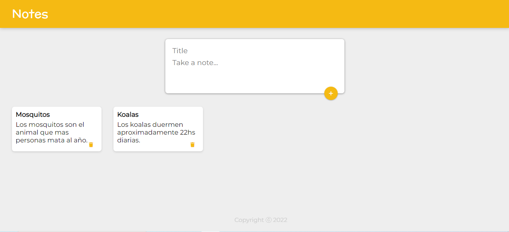

#Notes-app
Notes-app made with React

### Descripcion
Esta es una aplicación web hecha utilizando React, en la que puedes crear, guardar y borrar notas a través de un formulario de ingreso de datos. La app está hecha con módulos de React, props y hooks.

### Como utilizar
La app se ejecuta a travez del comando "npm start".

***

